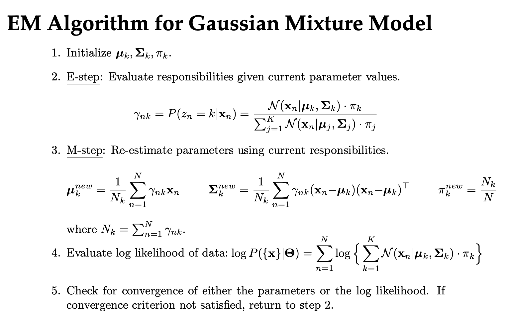

# Gaussian Mixture Model

## Motivation

A Gaussian Mixture Model (GMM) is like a K-means model, but probabilistic in nature. Instead of assigning a "hard" 
cluster update, it assigns weights for the given point belonging to each class. There are numerous advantages to using
the GMM over the standard K-means including:

- better handles "edge-cases", where a point is equidistant between clusters
- doesn't assume equal cluster size
- allows "optimal model" identification via the log-likelihood

## Core Concepts

We use the following concepts:

- `jit`
- `vmap`
- composing `jit` and `vmap`. The functional programming nature of `jax` means that we can compose these higher-order functions, making our code look very clean. See the `e_step` for more. 

## The Algorithm

We implement the steps in the following image. 

**Note** the image above was taken (with permission) from [Prof. Matt Golub](https://homes.cs.washington.edu/~mgolub/)'s course, [Machine Learning for Neuroscience (CSE599N)](https://courses.cs.washington.edu/courses/cse599n/24sp/).

---

# Optimal Model identification

These advantages listed above are better covered in a rigorous treatment, but the last point, optimal model identification
is the most interesting (to me). By optimizing the log-likelihood (instead of the Euclidean distance objective, as in k-means),
we can use some frameworks like the

- Bayesian Information Criterion (BIC)
- Akaike Information Criterion (AIC)

to determine the optimal number of clusters to specify.