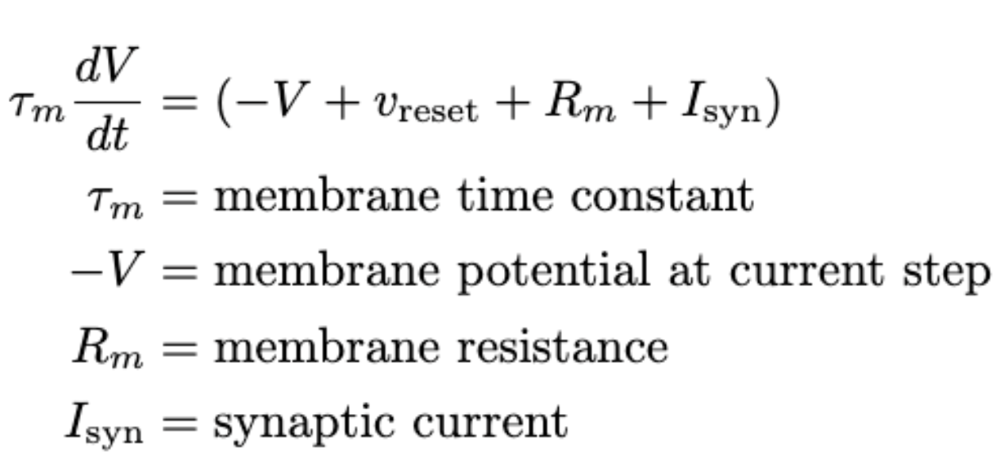

# Leaky_Integrate_And_Fire

A leaky Integrate-and-fire is a simplified model to simulate a neuron, or generally a neural circuit. The equations are as follows:

**Note**: there are many types of implementations at varying levels of biological realism. Something important to note is
that you can always get more realistic, but it's probably best to weight the cost-benefit of implementing such a complex system.

