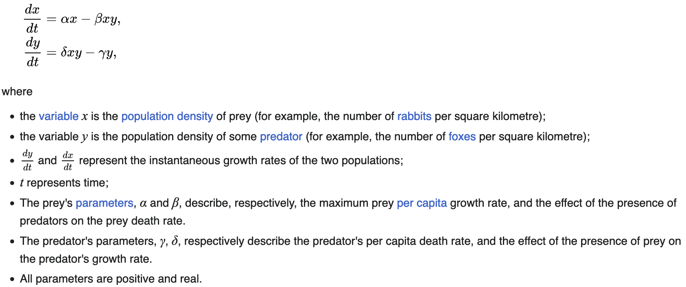

# Lotka-Volterra

The Lotka-Volterra equations are a first-order nonlinear differential equations. These equations describe the dtnamics of two species interacting in a predator-prey framework.

The equations are:

